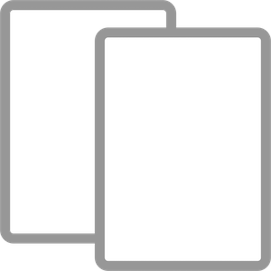
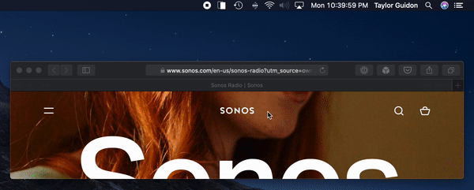
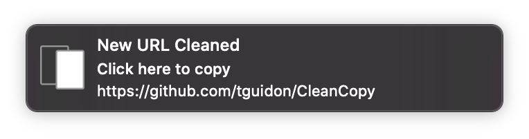

# CleanCopy

Copy a link, get a notifcation if it contains query params. Want to share the link without them? Click the notication and a clean link is in your pasteboard. Share links without tracking information.

Run CleanCopy and it will begin scanning your clipboard for links with query params. If a link with query params is found, a local notication is sent. Clicking on that will copy a stripped down URL, with no query params, to your clipboard.

